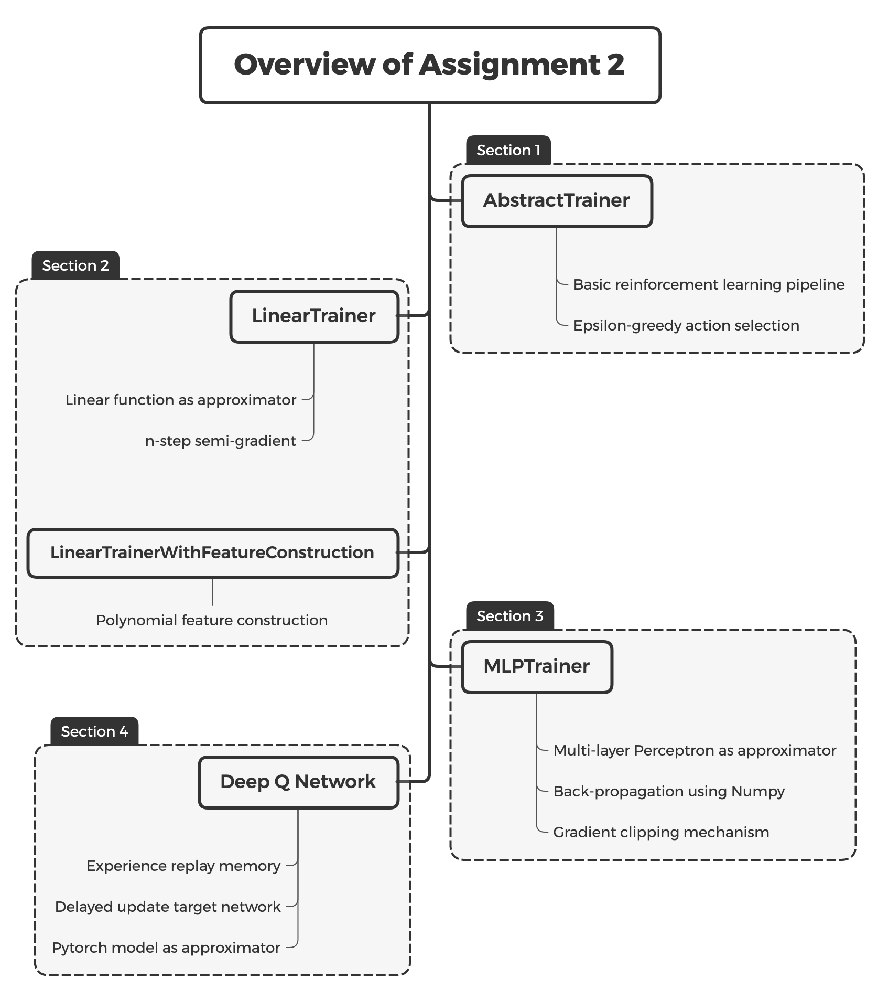

# IERG 6130 Assignment 2: Value Function Approximation in RL

**Due: 11:59 pm, March 11, 2020**

Welcome to the second assignment of this course! The objective of the Assignment 2 is to 

1. Implement serveral approximation techniques.
2. Understand the optimization process of n-step TD control.
3. Implement a simple neural network by Numpy.
4. Get familiar with Pytorch.

The following figure demonstrates the structure of assignment 2. In the first section of notebook, we build a basic RL pipeline. In the second section, we implement the linear function as approximator and also introduces feature construction technique. In the third section, we implement a simple neural network simply using Numpy package. In section 4, we use pytorch to build a nerual network as the approximator and implement the Deep Q Network. The following figure demonstrate the key points and the class we will implement in each section.

We left sufficient information in the jupyter notebook so please walk through the file: `IERG 6130 Assignment 2.ipynb`.

## Step 1: Setup your environment

The starter codes is at: https://github.com/cuhkrlcourse/ierg6130, go through the document at the root of this repostory (namely, `README.md`) for environment setup procedures. You need to prepare such packages:

1. Python 3
2. Jupyter Notebook
3. Gym
4. gym[atari]
5. Numpy
6. Pytorch

If you find anything confusing, feel free to open an issue at Github. We will response to you as soon as possible. If you get stuck by some strange errors, check the Github repo since it may be fixed by our latest commits.

## Step 2: Finish the notebook

Open a shell and `cd` to current directory `ierg6130/assignment2` and start a jupyter notebook server via `jupyter notebook`. (If you do not start jupyter notebook at this directory, you may fail to import some helper function).

Open your browser and then open the `IERG 6130 Assignment 2.ipynb`

We left many `[TODO]` in the file. Following the instructions in the notebook and finish all `[TODO]`. 

Make sure your code can be run completely bug-free. Our staff will run the codes by `Restart & Run All` so make sure nothing stop the running.

## Step 3: Submit your work

Following the procedure to submit your work:

1. Before submitting, remember to fill your name and student ID into the table at the top of the file.
2. Run your codes in sequential manner, that is, run it by `Restart & Run All`. Remember to keep everything intact.
3. Generate the PDF file via `File / Download As / pdf ` to the `assignment1` directory.
4. Compress the all files in `assignment1` directory into a **zip** file, whose name follows the pattern: `"IERG6130-hw2-{name}-{id}.zip".format(name="john", id="123456")` . For instance: `IERG6130-hw2-john-123456.zip`  **Some students submit only a notebook files. We suggest to follow the instruction and submit the zip file as well as the pdf file. Otherwise, you know.**
5. Send the **zip file** and the **PDF file** to us as **two seperated files** via email: cuhkrlcourse@googlegroups.com with title in pattern `"IERG6130-hw2-{name}-{id}-2020spring".format(name="john", id="123456")` for instance: `IERG6130-hw2-john-123456-2020spring` **In assignment 1, we have fully tested the googlegroups systems. It can receives all emails for students. So start from assignment 2, we will not reply to you after receiving your emails.**

------

*2019-2020 2nd term, IERG 6130: Reinforcement Learning and Beyond. Department of Information Engineering, The Chinese University of Hong Kong. Course Instructor: Professor ZHOU Bolei. Assignment author: PENG Zhenghao.*
